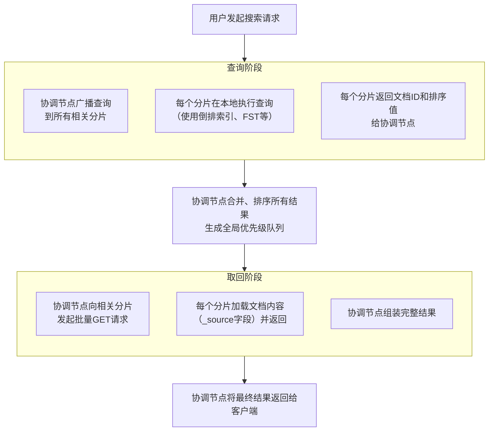

# Elasticsearch 搜索原理与中文分词详解

## 对话参与者
- **用户**：提问者
- **AI助手**：解答者（DeepSeek-V3）

## 一、ES 的搜索原理

Elasticsearch 的搜索是一个经典的 **“分散-收集” (Scatter-Gather)** 过程，主要分为两个核心阶段：**查询 (Query)** 和 **取回 (Fetch)**。

### 整体流程概览



### 1. 查询阶段 (Query Phase)
目标：确定哪些文档匹配查询条件，并生成一个按相关性评分排序的优先级队列。

客户端请求：应用程序将搜索请求发送到一个 ES 节点（成为协调节点）。

广播查询：协调节点将查询请求广播到目标索引的每一个相关分片（主分片或副本分片）。

分片本地查询：每个分片在本地独立执行查询，这个过程依赖两个核心数据结构：

倒排索引 (Inverted Index)：记录每个词条到包含它的文档列表的映射，是快速搜索的基石。

FST (Finite State Transducer)：用于在倒排索引中高效地查找词条，比哈希表更省内存。

执行过程：解析查询 -> 分析查询字符串（分词）-> 查找词条 -> 合并文档列表 -> 计算相关性评分 (TF/IDF, BM25)。

返回结果：每个分片将其 Top N（N = from + size）个匹配文档的 ID 和评分（不包括完整数据）返回给协调节点。

全局排序：协调节点收集所有分片的结果，合并并排序，生成一个全局的 Top N 文档列表。

### 2. 取回阶段 (Fetch Phase)
目标：根据查询阶段得到的文档 ID 列表，取回文档的完整数据。

发起GET请求：协调节点根据文档 ID 的路由信息，向包含这些文档的具体分片发送多文档获取 (multi-document GET) 请求。

取回数据：各个分片从本地存储中加载指定文档的完整 _source 内容。

组装并返回：分片将数据返回给协调节点，协调节点组装所有结果，最终返回给客户端。

重要补充与优化
深度分页问题：from 值过大会导致协调节点处理大量数据，消耗巨大。解决方案：

Scroll API：用于深度遍历，不适合实时请求。

Search After：使用上一页的结果来检索下一页，适合实时分页。

Filter 上下文：对于不关心相关性的精确过滤条件（如 status: published），应使用 filter 上下文。它会自动缓存结果，极大提升查询速度。

## 二、分词 (Analysis) 与查询类型
### 1. 分词的原理与设置
分词是将文本转换为一系列词条（Terms）的过程，由分析器 (Analyzer) 执行。

分析器的组成：

Character Filters (字符过滤器) 【可选】：预处理文本（如去除HTML标签）。

Tokenizer (分词器) 【必需】：将文本切分成词条（如按空格、标点）。

Token Filters (词条过滤器) 【可选】：处理词条（如转小写 lowercase、去除停用词 stop、提取词干 stemmer）。

示例：自定义分析器

```json
PUT /my_index
{
  "settings": {
    "analysis": {
      "analyzer": {
        "my_custom_analyzer": {
          "type": "custom",
          "char_filter": ["html_strip"],
          "tokenizer": "standard",
          "filter": ["lowercase", "my_stopwords"]
        }
      },
      "filter": {
        "my_stopwords": {
          "type": "stop",
          "stopwords": ["a", "an", "the"]
        }
      }
    }
  },
  "mappings": {
    "properties": {
      "title": {
        "type": "text",
        "analyzer": "my_custom_analyzer"
      }
    }
  }
}
```
### 2. 关键查询类型：term, match, bool
查询类型	核心用途	是否对输入分词	典型应用场景
term	精确值匹配	否	查询 keyword 类型的字段，如标签、状态、ID。
match	全文搜索	是	查询 text 类型的字段，处理用户输入的文本。
bool	组合多个查询	N/A	实现复杂的多条件逻辑查询（must AND, should OR, must_not NOT, filter）。
bool 查询示例：

```json
{
  "query": {
    "bool": {
      "must": [
        { "match": { "content": "es" } }
      ],
      "filter": [
        { "term": { "status": "published" } }
      ],
      "should": [
        { "match": { "title": "elasticsearch" } },
        { "match": { "title": "入门" } }
      ],
      "must_not": [
        { "term": { "author": "John" } }
      ]
    }
  }
}
```
## 三、中文分词
### 为什么需要中文分词？
中文文本是连续的汉字序列，词与词之间没有空格，需要专门的分词器将其切分成有意义的词条。

示例："我爱搜索引擎" -> ["我", "爱", "搜索引擎"]

核心挑战：歧义消除
交叉歧义："乒乓球拍卖完了" -> “乒乓球拍/卖完了” 或 “乒乓球/拍卖完了”

组合歧义："门把手弄坏了" -> “门把手/弄坏了” 或 “门/把手/弄坏了”

### 分词原理与方法
基于词典匹配：使用预设词典进行匹配（如最大匹配法）。速度快，但无法识别新词。

基于统计模型（如 HMM, CRF）：将分词视为序列标注问题（B,M,E,S），利用统计规律。能处理未登录词。

基于深度学习（如 Bi-LSTM, BERT）：利用神经网络捕捉上下文，准确率最高，但计算开销大。

现代分词器（如 IK）通常是混合模型，结合了词典和统计方法的优点。

### 通用的中文分词器推荐（ES插件）
分词器	推荐度	特点
IK Analyzer	⭐️⭐️⭐️⭐️⭐️	事实上的标准。支持 ik_smart(粗粒度) 和 ik_max_word(细粒度)，社区活跃，支持自定义词典。
jieba Analysis	⭐️⭐️⭐️	在Python中非常流行，有ES插件版，支持多种模式。
THULAC	⭐️⭐️⭐️	清华大学出品，基于统计模型，准确率高。
IK 分词器使用示例：

```json
PUT /my_chinese_index
{
  "settings": {
    "analysis": {
      "analyzer": {
        "default": {
          "type": "ik_max_word" // 设置默认分析器为IK细粒度模式
        }
      }
    }
  }
}
```
## 总结
ES搜索：理解 Query then Fetch 两阶段流程和倒排索引是核心。

查询选择：精确匹配用 term，全文搜索用 match，复杂逻辑用 bool。

中文处理：必须使用第三方分词插件，IK Analyzer 是首选，它通过词典和算法解决了中文分词的核心挑战——歧义消除。